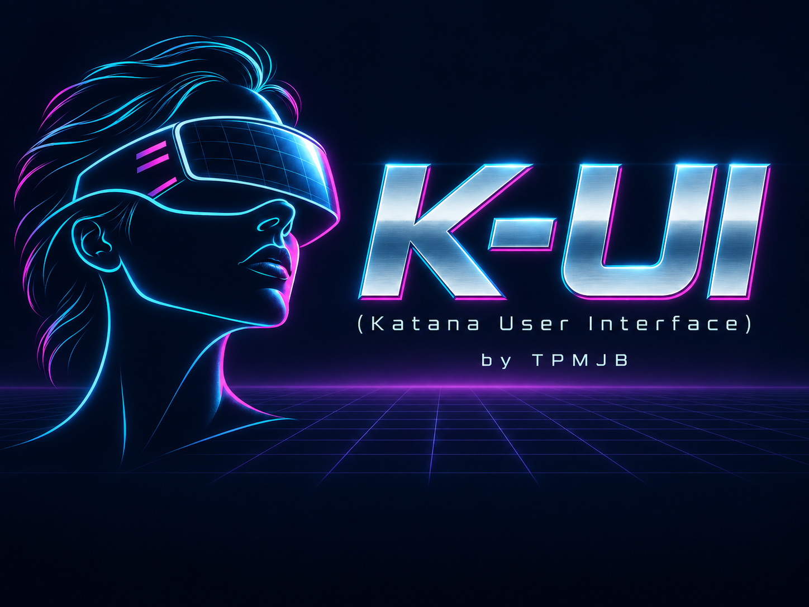
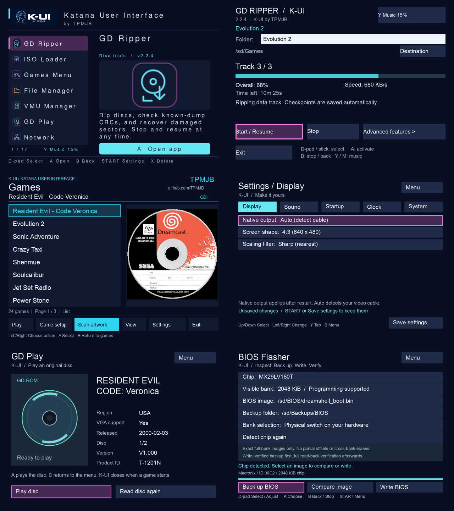

**☕ [Support TPMJB's work on K-UI on Ko-fi](https://ko-fi.com/tpmjb)**

Optional tips help support development, testing and documentation. Downloads remain free.

# K-UI — by TPMJB

**Katana User Interface** — a Dreamcast tools environment by TPMJB, built on
SWAT's DreamShell and KallistiOS. Formerly DreamShell NeXT.

K-UI includes exFAT storage, a controller-friendly launcher, redesigned utilities,
and GD ripping with checkpoints, catalog verification and targeted recovery.

**[Download the full NeXT 0.9.1 release](https://github.com/TPMJB/DreamShell_NeXT/releases/tag/0.9.1)**
— includes the complete DS folder, boot CDs, firmware and desktop tools.
Read [the published installation and release notes](https://github.com/TPMJB/DreamShell_NeXT/blob/0.9.1/RELEASE-NOTES.md)
before updating. [Browse the released 0.9.1 source](https://github.com/TPMJB/DreamShell_NeXT/tree/0.9.1).

**K-UI 1.0 is a test candidate on `codex/k-ui`.** It includes the integrated
project work, the tested bootloader/music fixes, new artwork throughout the shell,
and five original synth loops. The full 1.0 release waits for console testing.
See [candidate release notes](RELEASE-NOTES.md) and the [release checklist](docs/release-checklist.md).

[Current app previews](docs/screenshots/k-ui/README.md) use the actual layouts
with sample data. The [0.9 gallery](docs/screenshots/README.md) is retained as a historical archive.

## Included in the 1.0 source

- **GD Ripper 2.2.4:** disc-title detection, Stop/Resume, CRC checkpoints, TOSEC
  and Redump-derived catalogs, optional saved-file scans, and targeted recovery.
  Recovery reports original, recovered and unresolved totals across sessions.
- **Shared Games folders:** rip to `/ide/Games`, `/sd/Games` or `/pc/Games` and
  browse the same locations in Games. Custom destinations remain available.
- **FAT16/FAT32/exFAT:** boot, shell and ISO Loader storage support, including
  the FatFs R0.16 maintenance fixes from 0.9.1.
- **Games and ISO Loader:** controller navigation, artwork extraction, eligible
  CD-audio previews, image checks and launch reports. Compatibility varies by
  game and storage hardware.
- **K-UI utilities:** File Manager, VMU Manager, GD Play, Settings, BIOS Flasher,
  Region Changer, Speedtest, Memtest and Network, plus the other standard apps.
- **Bootloader 3.3 and music:** checked core loading, recovery menu,
  optional boot settings, K-UI artwork and five original synth loops in Launcher and GD Ripper.

A working NeXT 3.0/3.1 boot disc can load the updated DS folder. The project
release number is independent of the DreamShell **4.0.5 Beta 3** core/API and
individual app versions. Check [hardware results and limits](docs/compatibility.md)
before assuming a particular game or device is supported.

## Guides

- [Install, upgrade, preserve settings, and choose a boot disc](docs/installation.md)
- [GD ripping, recovery and desktop verification](utils/README.gd-verify.md)
- [Games and ISO Loader controls](utils/README.iso-loader-next.md)
- [Settings, GD Play and maintenance utilities](utils/README.utility-apps.md)
- [VMU backup, copying and restore](utils/README.vmu-manager.md)
- [exFAT requirements and limits](utils/README.exfat.md)
- [Keyboard and folder picker](utils/README.input-ui.md)
- [Bootloader configuration](utils/README.boot-branding.md)
- [Launcher controls](utils/README.launcher.md) and [music](utils/README.menu-music.md)
- [Saved-read diagnostics](utils/README.readback-diagnostic.md)

## Build

Use **Actions → Full NeXT release → Run workflow** (`full-release.yml`; the test
run is named **Full K-UI release**), select `codex/k-ui`, and leave
**Publish a GitHub release** unchecked to produce a complete test artifact.
Publication is a separate explicit choice. Master pushes and pull requests run host checks and
do not start a full toolchain/Dreamcast build.

[Build instructions](docs/building.md) cover Actions, local Ubuntu builds and
the exact release outputs. `codex/k-ui` is the current test source; use the
`0.9.1` tag when reproducing that published release. The old `v1.0.0` tag is a
historical development milestone, not the upcoming 1.0 release.

## Licensing and contributions

DreamShell-specific code and K-UI additions use
[PolyForm Noncommercial 1.0.0](LICENSE), except where separate terms apply.
Third-party components retain their own licenses. Preserve the required
[notices](NOTICE); see [licensing and attribution](docs/licensing.md) for scope.

Contributors retain their copyrights. K-UI uses the applicable existing licenses
and does not require a separate CLA or commercial relicensing grant. See
[CONTRIBUTING.md](CONTRIBUTING.md) for submissions and bug reports.
