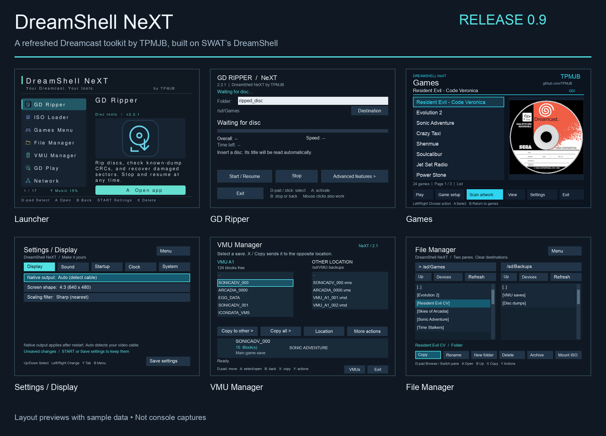

**☕ [Support TPMJB's work on DreamShell NeXT on Ko-fi](https://ko-fi.com/tpmjb)**

Optional tips help support development, testing and documentation. Downloads remain free.

# DreamShell NeXT — by TPMJB

A Dreamcast tools environment inspired by DreamShell
and KallistiOS. NeXT adds exFAT boot/storage support, a controller-friendly app
launcher, a QWERTY keyboard and directory browser, and reliable GD ripping with
checkpoints, catalog verification and targeted recovery.

**[Download the full NeXT 0.9.1 release](https://github.com/TPMJB/DreamShell_NeXT/releases/tag/0.9.1)**
— includes the complete DS folder, boot CDs, firmware and desktop tools.
Read [installation and release notes](https://github.com/TPMJB/DreamShell_NeXT/blob/0.9.1/RELEASE-NOTES.md) before updating.
[Browse the released 0.9.1 source](https://github.com/TPMJB/DreamShell_NeXT/tree/0.9.1).
Copy the whole DS folder together; a working NeXT bootloader 3.0 CD can be reused.

[](docs/screenshots/README.md)

**[Explore all 14 app screens →](docs/screenshots/README.md)**
— click any image in the gallery to open it at full size.
These are layout previews from the released 0.9 source, with sample data.

## Guides

- [exFAT compatibility and installation](utils/README.exfat.md)
- [Keyboard, directory picker and FAT32 regression check](utils/README.input-ui.md)
- [GD dump verification](utils/README.gd-verify.md)
- [CRC read-back diagnostics](utils/README.readback-diagnostic.md)
- [Upstream changes reviewed for this release](docs/upstream-review.md)

NeXT's 0.9.1 release number is independent of the DreamShell 4.0.5 Beta 3 core/API
version. Original DreamShell, KallistiOS and third-party credits remain in the
source and distributed notices. Other apps and hardware combinations are built
but are not all validated on a physical console.

## Build

### Setup environment
##### Packages
```console
sudo apt update
sudo apt install -y gawk patch bzip2 tar make cmake pkg-config
sudo apt install -y gettext wget bison flex sed meson ninja-build
sudo apt install -y build-essential diffutils curl python3 rake exfatprogs dosfstools
sudo apt install -y genisoimage squashfs-tools texinfo git
sudo apt install -y libgmp-dev libmpfr-dev libmpc-dev libelf-dev libisofs-dev
sudo apt install -y libpng-dev libjpeg-dev liblzo2-dev liblua5.2-dev
cd /tmp
git clone https://github.com/LuaDist/tolua.git
cd /tmp/tolua && mkdir build && cd ./build
cmake ../ && make && sudo make install
```
##### Code
```console
sudo mkdir -p /usr/local/dc/kos
sudo chown -R $(id -u):$(id -g) /usr/local/dc
cd /usr/local/dc/kos
git clone https://github.com/KallistiOS/kos-ports.git
git clone https://github.com/DC-SWAT/KallistiOS.git kos
cd /usr/local/dc/kos/kos
git clone https://github.com/TPMJB/DreamShell_NeXT.git ds
git -C ds checkout 0.9.1
git checkout `cat ds/sdk/doc/KallistiOS.txt`
cp ds/sdk/toolchain/environ.sh environ.sh
cp ds/sdk/toolchain/patches/*.diff utils/kos-chain/patches
cd /usr/local/dc/kos/kos/ds
git -C .. apply "$PWD"/sdk/kos-patches/cdrom-timeout-deadlock.patch \
  "$PWD"/sdk/kos-patches/sd-interface-query.patch \
  "$PWD"/sdk/kos-patches/w5500-interface-query.patch
```
##### Toolchain
```console
sudo mkdir -p /opt/toolchains/dc
sudo chown -R $(id -u):$(id -g) /opt/toolchains/dc
cd /usr/local/dc/kos/kos
cp ./ds/sdk/toolchain/Makefile.cfg ./utils/kos-chain/Makefile.cfg
cd utils/kos-chain && make
```
##### SDK
```console
cd /usr/local/dc/kos/kos
source ./environ.sh
make && cd ../kos-ports && ./utils/build-all.sh
cd ${KOS_BASE}/ds/sdk/bin/src && make && make install
cd ${KOS_BASE}/ds
ln -nsf `which tolua` sdk/bin/tolua
ln -nsf `which mkisofs` sdk/bin/mkisofs
ln -nsf `which mksquashfs` sdk/bin/mksquashfs
```

### Use environment
##### for each new terminal type:
```console
cd /usr/local/dc/kos/kos/ds && source ../environ.sh
```

### Build code
##### Full build
```console
make build
```
##### Full clean
```console
make clean-all
```
##### Make release package
```console
make release
```
##### Update all code from GitHub
```console
make update
```
##### Update all code from GitHub and re-build
```console
make update-build
```
##### Update and re-build kos-ports
```console
make build-ports
```
##### Re-build toochain (if updated)
```console
make toolchain
```
##### Core and libraries only
```console
make
```
##### Libraries only
```console
cd ${KOS_BASE}/ds/lib && make
```
##### Modules, applications and commands only
```console
cd ${KOS_BASE}/ds/modules && make
cd ${KOS_BASE}/ds/commands && make
cd ${KOS_BASE}/ds/applications && make
```
##### Firmwares only
```console
cd ${KOS_BASE}/ds/firmware/bootloader && make && make release
cd ${KOS_BASE}/ds/firmware/isoldr && make -j8 && make install
cd ${KOS_BASE}/ds/firmware/hollysh && make && make install
```

### Running
- dc-tool-ip: `make run`
- dc-tool-serial: `make run-serial`
- lxdream emulator: `make lxdream`
- nulldc emulator: `make nulldc`
- flycast emulator: `make flycast`
- make cdi image: `make cdi`
- make IDE/SD FAT32 image: `make ide`

## GD Ripper 2.0.2

Version 2.0.2 fixes missing `rip.log` files and the failure to create the first
CRC checkpoint. The pinned FAT library can reopen files with `O_CREAT`, but
fails to create missing files with that flag alone. The ripper now uses explicit
exclusive creation for new logs, CRC journals, repair backups and bad-sector
maps, preserving existing records. Regression tests run the actual logger and
metadata writers against the pinned FatFs on FAT16 and FAT32 volumes.

If 2.0.1 is already installed, replace the entire `DS/apps/gd_ripper/` folder.
Keep the existing dump folder and resume. See the [ripper guide](utils/README.gd-verify.md)
for installation and recovery from a stop after Track 1.

GD Ripper now calculates CRC while ripping, checkpoints it for resume, and
compares completed tracks with bundled TOSEC and Redump catalogs. Normal
verification no longer rereads the whole dump through serial SD.

GD Ripper 2.1.0 adds an optional **Recover damaged disc** mode: collect readable
sectors first, then ask before running targeted recovery passes. Unresolved
holes remain explicitly incomplete. Recovery resumes from its saved queue,
validates and reads back replacements, and updates track CRCs without another
full SD read. Replace the entire `DS/apps/gd_ripper` folder to upgrade from a
working 2.0.2/2.0.3 installation.

The redesigned interface uses direct controller/button selection, automatic
disc-title detection, explicit Stop/error status, and an Advanced Features
page. Optional advanced checks validate data-sector addresses and EDC/ECC,
scan saved dumps, and reread flagged sectors while backing up replaced bytes.

See [the ripper/verifier guide](utils/README.gd-verify.md) for installation,
recovery steps, catalog limitations, and the included desktop tools.


## Licensing

DreamShell core and DreamShell-specific components (including ISO Loader) are licensed under the PolyForm Noncommercial License 1.0.0 in `LICENSE`.

Required notices are in `NOTICE`.

This distribution also includes third-party components under their own licenses (for example, `lib/`, `modules/`, and parts of `sdk/`). For those, the license stated in the corresponding file or directory applies.

## Contributing

Contributions require acceptance of `CONTRIBUTING.md` and `CLA.md`.
