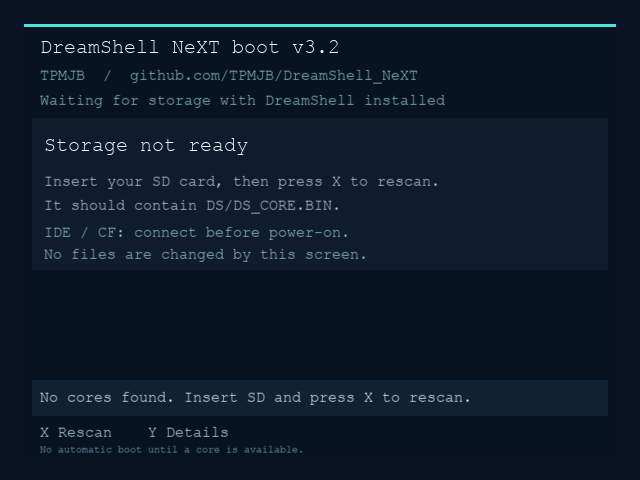
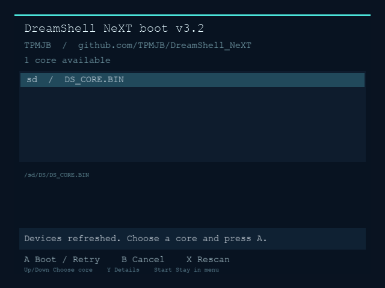
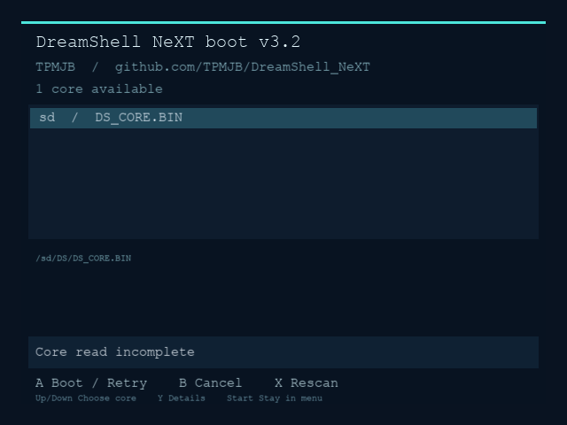

# Bootloader 3.2 recovery layout

These previews use draw commands captured from the production recovery menu
under its host harness. Courier substitutes for the Dreamcast BIOS font;
they verify layout and wording, not real PVR rendering or console behavior.

Regenerate with `python3 utils/preview_bootloader.py docs/bootloader-preview`.
The generated CSV traces are temporary geometry data; commit only the PNGs.
The next console check is booting without SD, inserting it, pressing X to rescan,
and pressing A to boot. IDE/CF must be connected before power-on.
