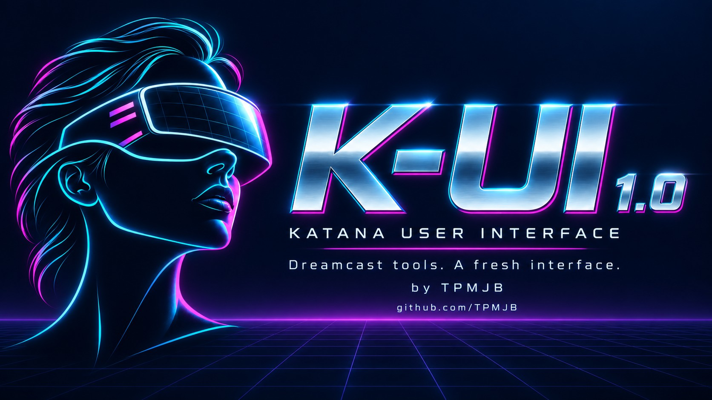

# K-UI 1.0 launch kit

Use these drafts **after** the `k-ui-1.0` release is published and its ZIP is
available. They are drafts for TPMJB to post; no Reddit or forum post has been sent.

## Artwork

- [Wide release banner](k-ui-release-banner.jpg): README, forum opening image and release announcement.
- [Square social cover](k-ui-social-square.jpg): Reddit/gallery cover.
- [Tool-by-tool showcase](showcase/README.md): 15 individual app/screen cards and
  a six-screen overview, with captions and an explanation of why each tool matters.
- [Browse offline](showcase/index.html): open this file after extracting the kit.
- [Copy-ready captions](showcase/captions.md): captions and significance notes for
  the full gallery. The images use host-rendered layouts with sample data.

The new images are promotional illustrations made with image-generation assistance,
using the approved K-UI visor portrait and chrome wordmark as the reference.
They are not screenshots. The existing boot textures and fixed bootloader remain
as tested; these larger images are for the release page and social posts.

## Posting order

1. Publish the GitHub release and verify that `K-UI-v1.0.zip` and `SHA256SUMS` are attached.
2. Post [the Reddit draft](reddit-post.md) with the square cover, followed by a
   current console photo or short video. If you use the host gallery instead,
   retain its sample-data/layout-preview caption.
3. Post [the forum draft](forum-post.bbcode.txt) with the wide banner. The text
   uses standard BBCode; preview the formatting in the destination forum.
4. Keep the versioned GitHub release as the download link. Put optional support
   at the end. Preserve the known-issue paragraph and upstream credit.

Suggested gallery order: cover, Launcher, GD Ripper, Advanced/recovery, Games,
ISO Loader, VMU Manager, File Manager. Use Settings, GD Play, Network, firmware
utilities, diagnostics and Boot Recovery in a longer forum gallery or follow-up.
A short real-console clip opening File Manager and returning to Launcher is more
useful evidence than another promotional image. Read the destination community's
current posting rules before submitting; no specific forum or subreddit is assumed.

The public repository remains `TPMJB/DreamShell_NeXT`. Renaming it is separate
from the product's K-UI identity and is not required to publish this release.
