# K-UI 1.0 — image captions and significance

These images show host-rendered K-UI layouts with sample data, not console or emulator captures. Game lists, progress, benchmark values, pass/fail statuses and hardware identities are illustrative. The boot recovery preview uses a substitute host font. Promotional frames and captions sit outside the app UI. K-UI is by TPMJB, built on SWAT's DreamShell and the credited upstream projects.

## Launcher

**Your Dreamcast tools, one clear home**

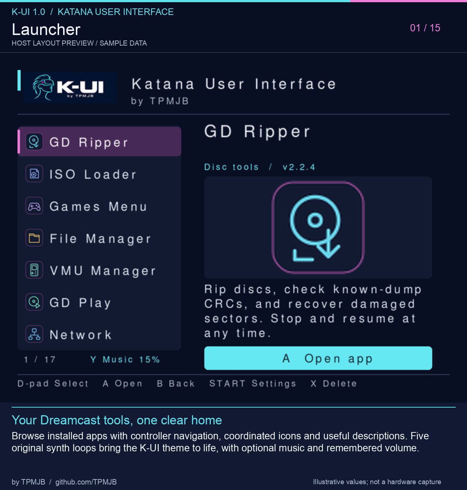

Browse installed apps with controller navigation, coordinated icons and useful descriptions. Five original synth loops bring the K-UI theme to life, with optional music and remembered volume.

**Why it matters:** The app list and details pane make each tool easier to discover. K-UI adds a consistent neon identity and selects one optional track per visit. Music plays from RAM, and loading and preference saves run off the immediate UI path to keep controls responsive.

## GD Ripper

**Rip, resume, and check your discs**

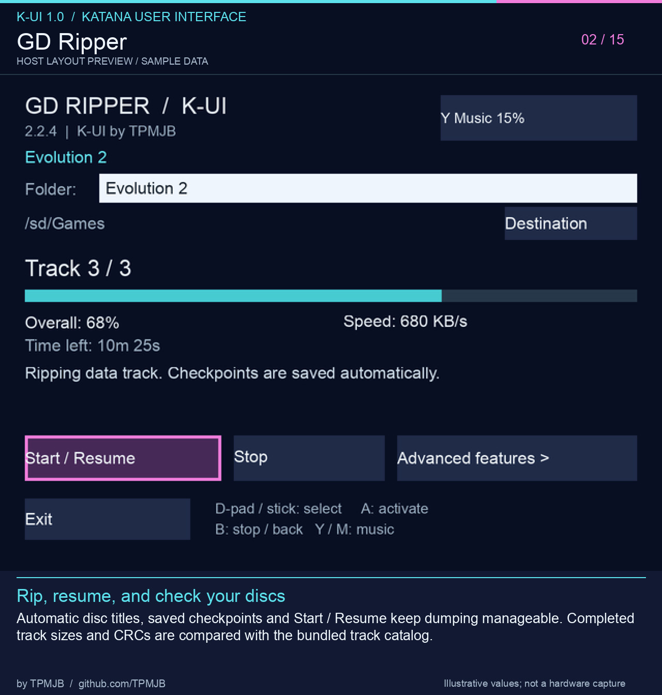

Automatic disc titles, saved checkpoints and Start / Resume keep dumping manageable. Completed track sizes and CRCs are compared with the bundled track catalog.

**Why it matters:** Checkpoints preserve progress across interruptions, and shared Games folders connect ripping with library browsing. The fast CRC check uses hashes collected during writing; an optional saved-dump scan rereads storage. A catalog match covers the represented track files. The intermittent MDK2 dumping crash remains unresolved.

## GD Ripper — Advanced

**Recovery you can follow across sessions**

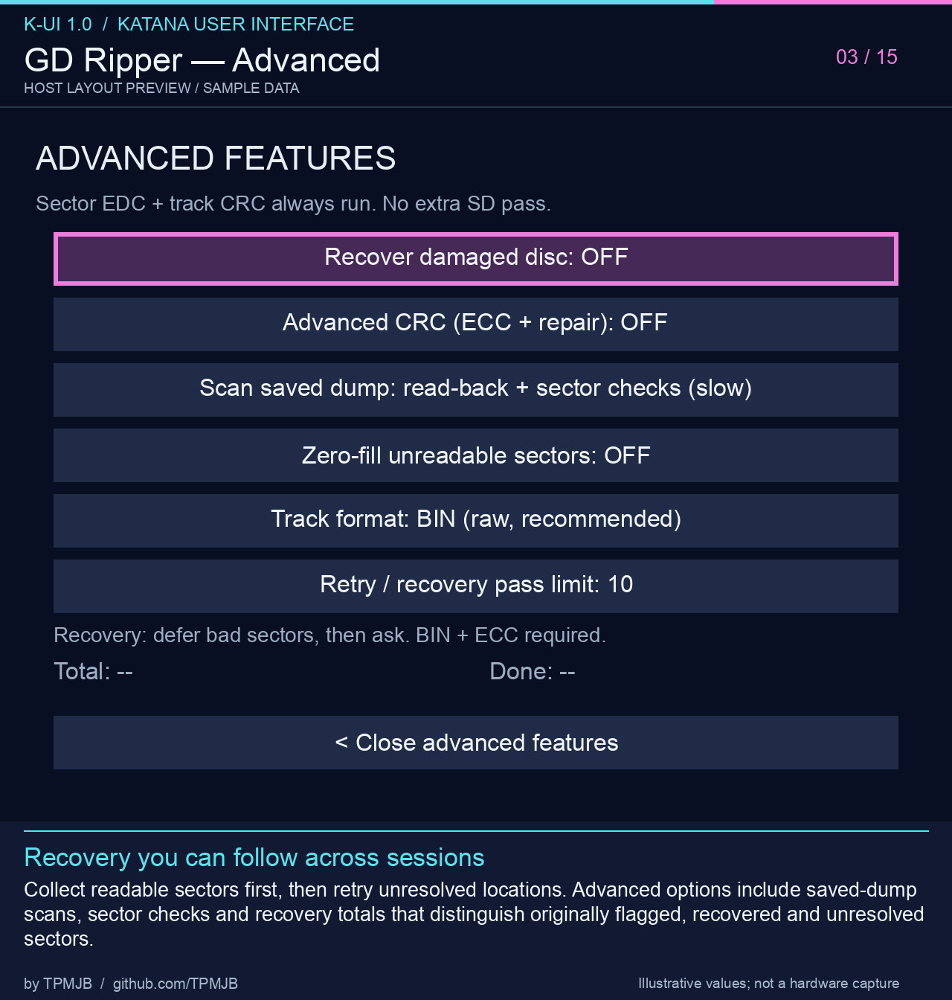

Collect readable sectors first, then retry unresolved locations. Advanced options include saved-dump scans, sector checks and recovery totals that distinguish originally flagged, recovered and unresolved sectors.

**Why it matters:** Targeted recovery preserves successful repairs and resumes against the remaining locations. K-UI 1.0 corrects cumulative totals and interrupted finalization, so reopening a dump reflects earlier work. This reporting fix does not change the optical retry algorithm. Unreadable placeholders remain unresolved; recovery cannot guarantee that damaged media will become readable.

## Games

**Turn your dumps into a library**

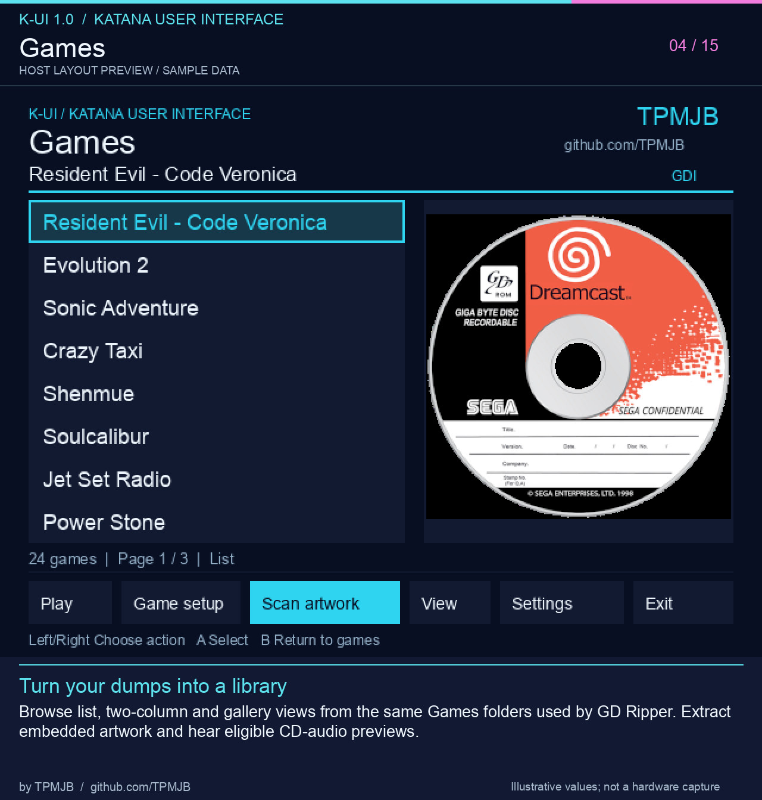

Browse list, two-column and gallery views from the same Games folders used by GD Ripper. Extract embedded artwork and hear eligible CD-audio previews.

**Why it matters:** Shared folders reduce the steps between making a dump and finding it in the library. Artwork scanning keeps existing covers and extracts missing embedded thumbnails. Preview music requires separate game-session audio tracks; the app does not download box art or decode music inside game data.

## ISO Loader

**Clear controls for game loading**

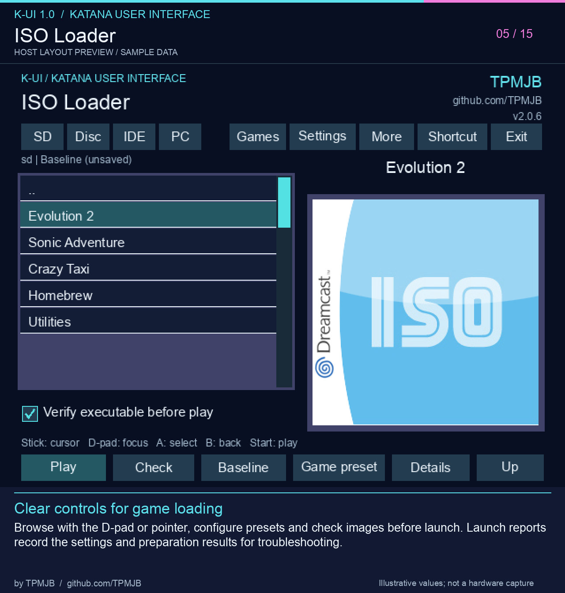

Browse with the D-pad or pointer, configure presets and check images before launch. Launch reports record the settings and preparation results for troubleshooting.

**Why it matters:** Immediate folder refresh and coordinated controller actions make setup easier. Image checks and an executable CRC comparison catch specific input or read problems before handoff. They do not establish game compatibility: serial-SD bandwidth limits remain, and Bust-A-Move 4 is still a documented black-screen case.

## File Manager

**Two panes, straightforward file transfers**

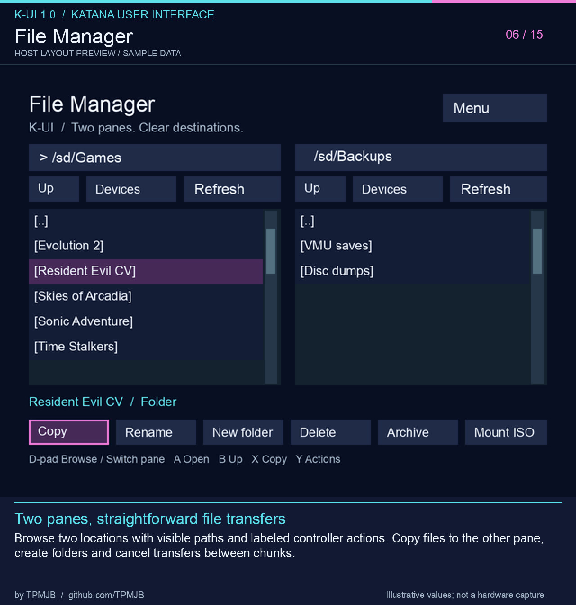

Browse two locations with visible paths and labeled controller actions. Copy files to the other pane, create folders and cancel transfers between chunks.

**Why it matters:** The redesigned layout puts source, destination and actions on screen together. K-UI 1.0 includes the File Manager startup and Lua lifetime fixes. Checked copy handling rejects existing destination files and invalid paths; canceling a directory copy retains files that already completed.

## VMU Manager

**Back up saves individually or together**

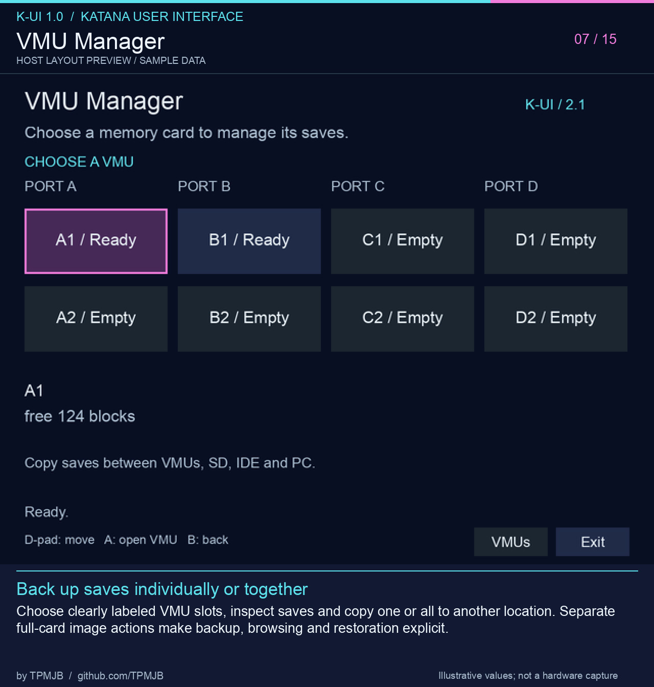

Choose clearly labeled VMU slots, inspect saves and copy one or all to another location. Separate full-card image actions make backup, browsing and restoration explicit.

**Why it matters:** Copy all saves exports individual VMS files to SD or IDE, or copies directly to another VMU, while reporting skipped names. A full 128 KiB VMD image preserves card metadata for whole-card restoration. These distinct actions address different backup needs without making users guess what a card image contains.

## Settings

**Know what changed and what saved**

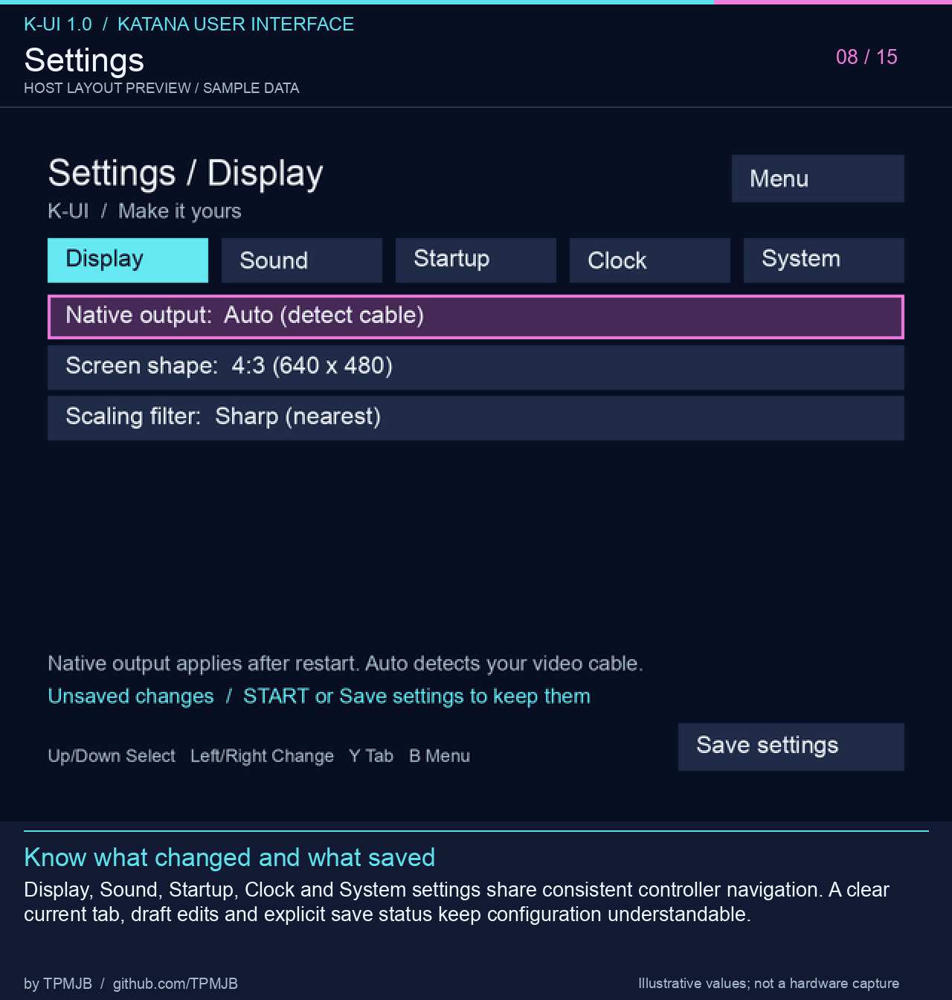

Display, Sound, Startup, Clock and System settings share consistent controller navigation. A clear current tab, draft edits and explicit save status keep configuration understandable.

**Why it matters:** The filled current tab distinguishes the open page from the selected control. Configuration changes remain in a draft until saved, and saving verifies the result in boot load order. Leaving with pending edits prompts for discard; clock application is a separate action.

## GD Play

**Disc information with a dependable menu**

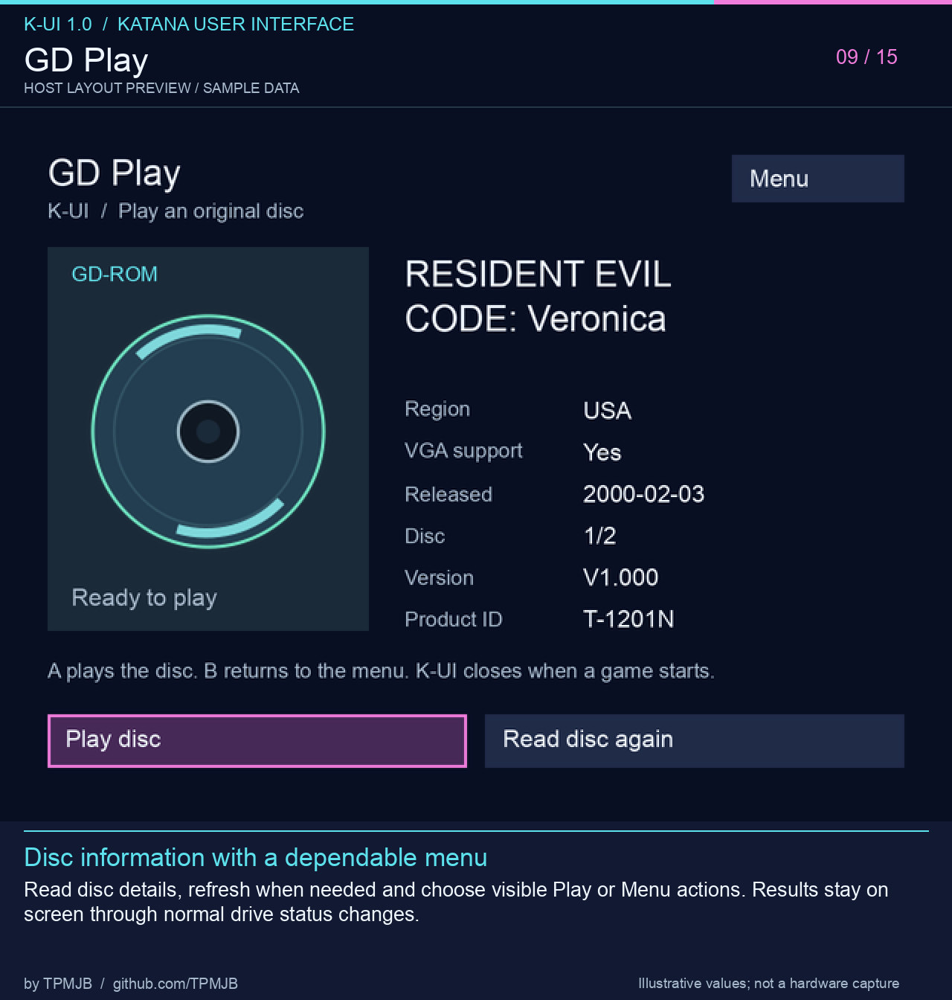

Read disc details, refresh when needed and choose visible Play or Menu actions. Results stay on screen through normal drive status changes.

**Why it matters:** Disc polling uses a worker with bounded drive commands. Ordinary seeking or spin-down no longer triggers repeated rereads and flashing results, and Menu remains visible during errors or with no disc. Launching a retail game exits the shell; this does not add an in-game return feature.

## Network

**See your connection and server status**

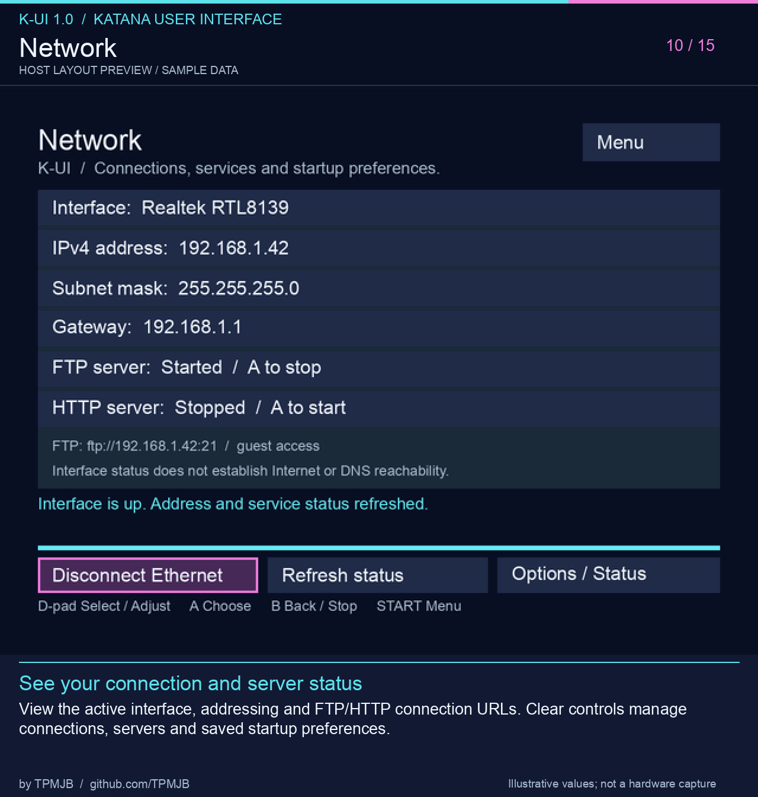

View the active interface, addressing and FTP/HTTP connection URLs. Clear controls manage connections, servers and saved startup preferences.

**Why it matters:** Refresh reads current network state, while draft preferences use explicit saving and verification. Server state is visible before connection changes, and module lifetime handling keeps running server threads backed by valid code. Interface-up status alone does not confirm Internet access; the existing services suit a trusted LAN.

## BIOS Flasher

**Inspect, back up, compare, then write**

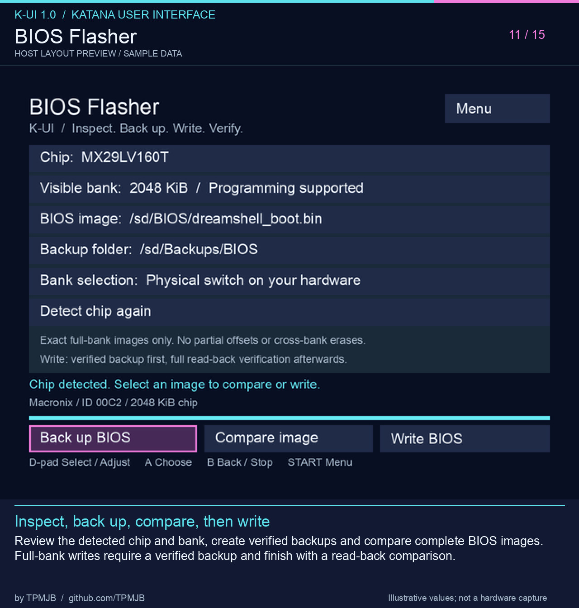

Review the detected chip and bank, create verified backups and compare complete BIOS images. Full-bank writes require a verified backup and finish with a read-back comparison.

**Why it matters:** The redesigned workflow adds explicit sequencing, full-bank bounds and phase-specific errors around firmware operations. Hardware bank selection remains physical, and suitable flash hardware is required. These checks help catch write problems; they cannot certify that a custom BIOS will boot.

## Region Changer

**Review stored settings before applying changes**

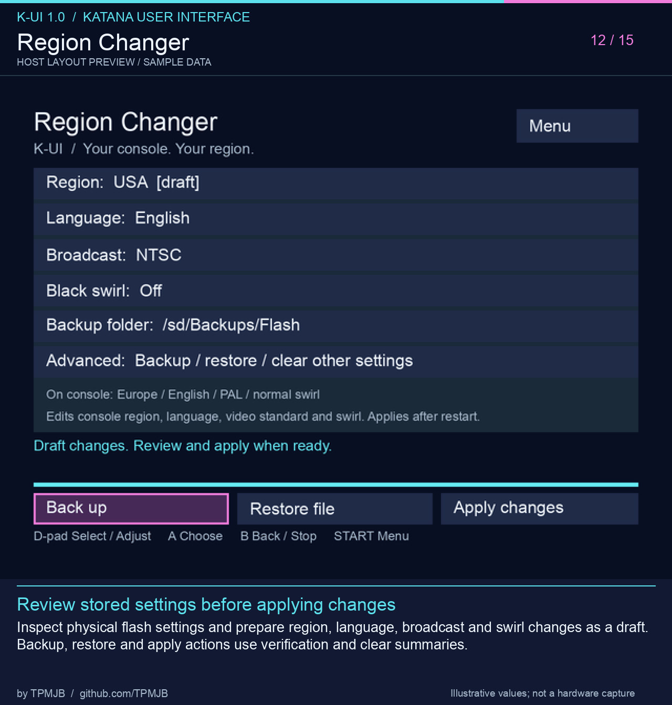

Inspect physical flash settings and prepare region, language, broadcast and swirl changes as a draft. Backup, restore and apply actions use verification and clear summaries.

**Why it matters:** Physical flash reads distinguish stored settings from temporary BIOS overrides. Apply preserves unrelated factory bytes, and erase operations require a verified backup followed by read-back comparison. Unexpected layouts block writes while retaining viewing and backup; the tool does not bypass hardware write protection.

## Speedtest

**Measure storage with useful context**

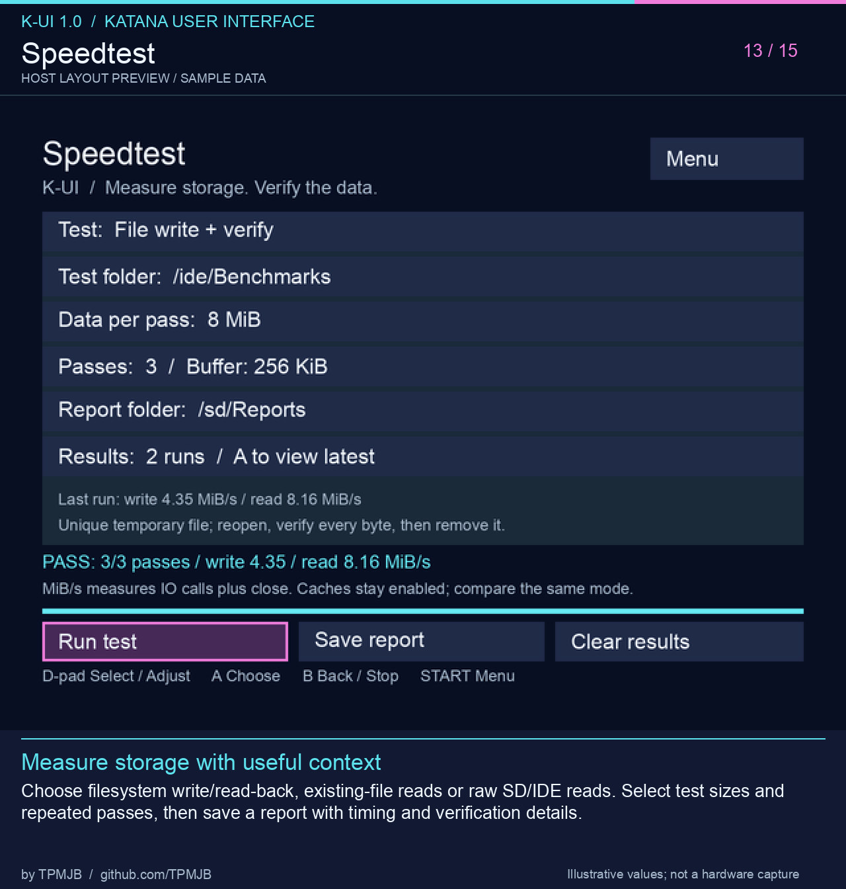

Choose filesystem write/read-back, existing-file reads or raw SD/IDE reads. Select test sizes and repeated passes, then save a report with timing and verification details.

**Why it matters:** The redesign makes test mode, workload and completion status visible. Reports distinguish stopped or failed runs and include byte counts and verification results. Filesystem tests create unique temporary files, and raw device tests are read-only. Compare equivalent modes and sizes; preview values are illustrative.

## Memtest

**Memory diagnostics with readable results**

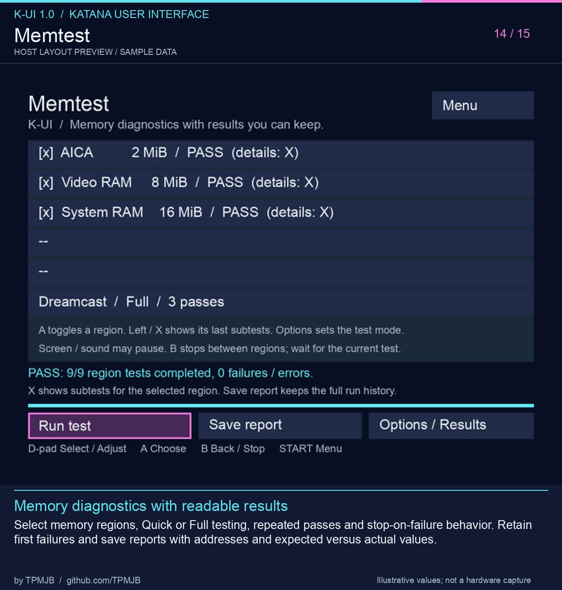

Select memory regions, Quick or Full testing, repeated passes and stop-on-failure behavior. Retain first failures and save reports with addresses and expected versus actual values.

**Why it matters:** K-UI improves controls and reporting around the existing test engine. Results preserve the first detected failure and separate engine errors from data failures. The engine excludes its live RAM execution area, so this is not exhaustive memory coverage; illustrated screens do not represent completed hardware tests.

## Boot Recovery

**Missing storage gets a clear next step**

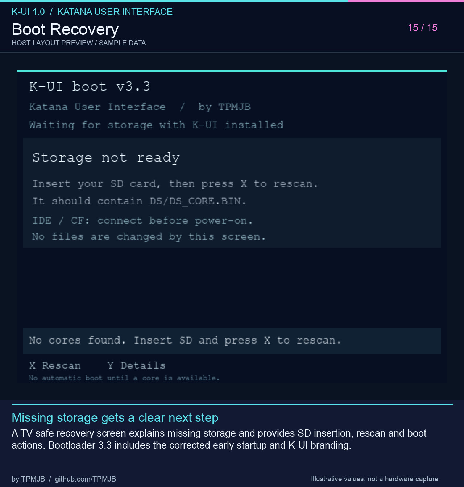

A TV-safe recovery screen explains missing storage and provides SD insertion, rescan and boot actions. Bootloader 3.3 includes the corrected early startup and K-UI branding.

**Why it matters:** The corrected loader reached recovery and booted after SD insertion on the maintainer's hardware. The revised screen removes the legacy animated background and keeps instructions inside a television-safe area. Receiving the loader changes requires the updated boot disc; updating SD files alone does not replace it.

## Release note to retain when sharing

One intermittent GD-ROM dumping crash, reported with MDK2, remains unresolved. Recovery is not guaranteed; game/device compatibility varies. A catalog CRC match applies to the represented track files and does not establish subchannel/lead-in capture.

Post after the [versioned release](https://github.com/TPMJB/DreamShell_NeXT/releases/tag/k-ui-1.0) and its ZIP are publicly available. Keep the preview labels and upstream credit. The [Reddit](../reddit-post.md) and [forum](../forum-post.bbcode.txt) drafts are in the parent launch kit.
