# K-UI candidate app previews

These are host layout previews from the candidate source with sample data,
not photographs or emulator/hardware captures. Boot recovery uses a substitute
host font; the console uses the BIOS font. Splash and badge artwork is converted
from the approved production images.

## Launcher

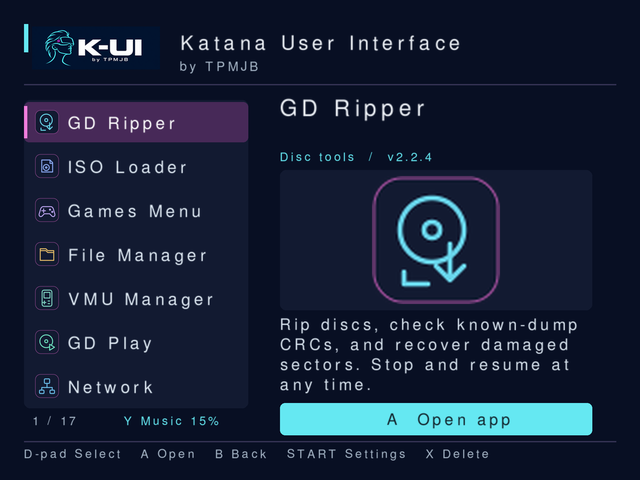

## GD Ripper

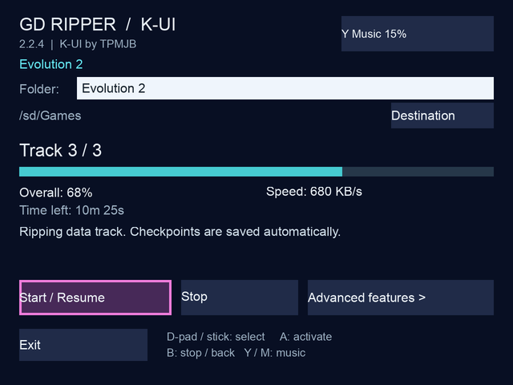

## Games

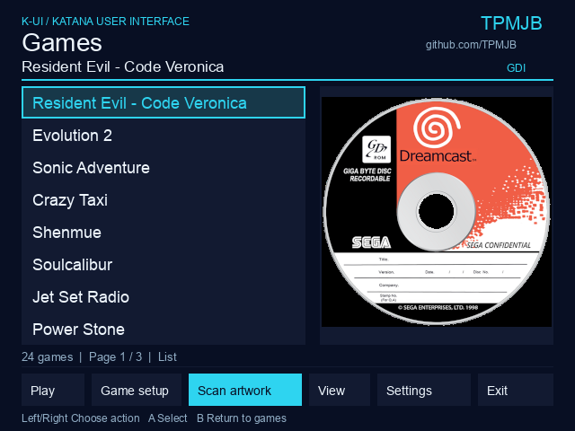

## ISO Loader

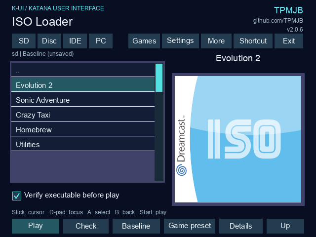

## Settings

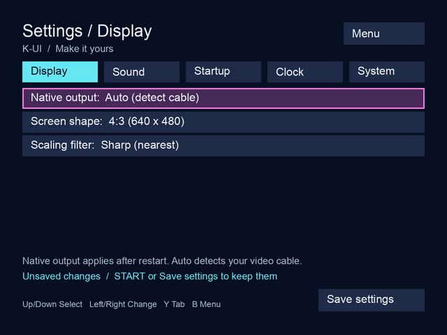

## GD Play

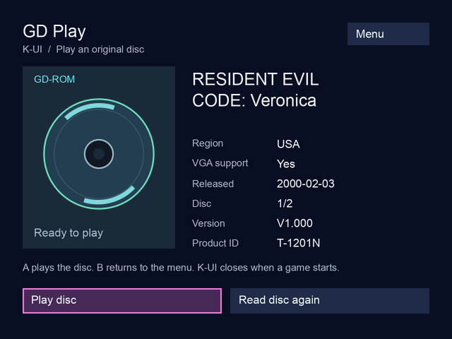

## File Manager

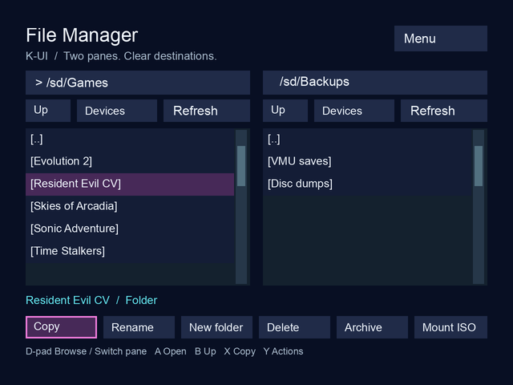

## VMU Manager

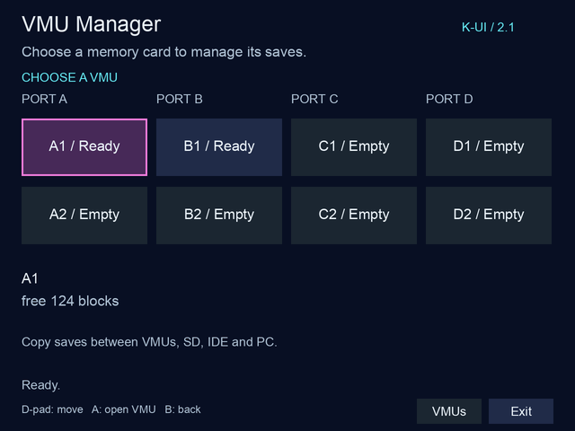

## BIOS Flasher

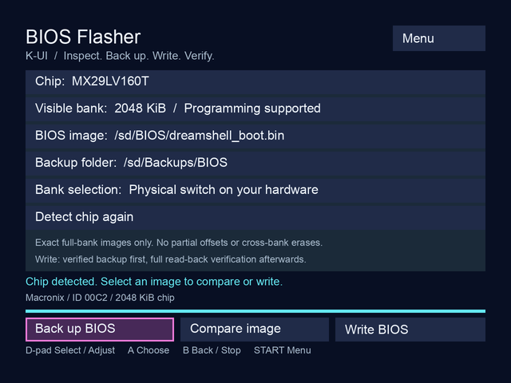

## Region Changer

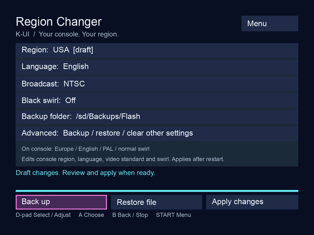

## Speedtest

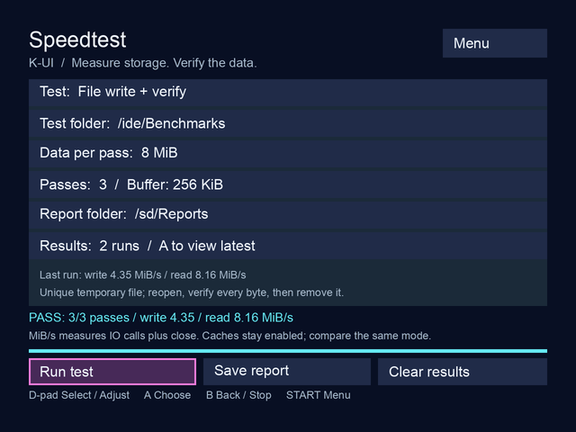

## Memtest

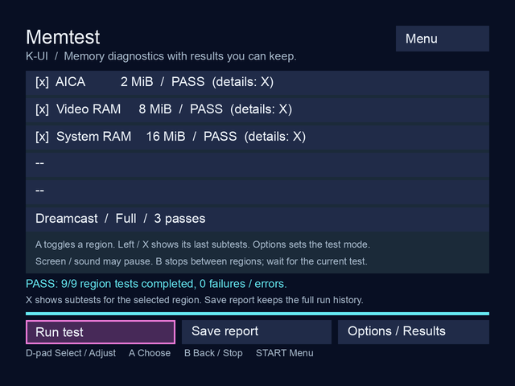

## Network

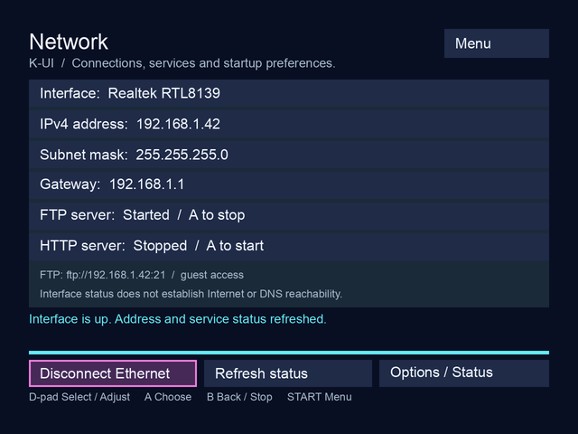

## Boot recovery

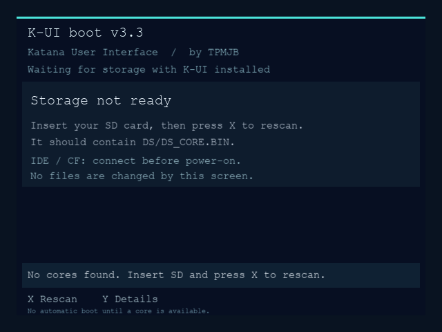
